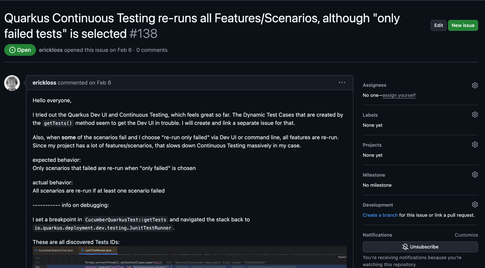

% I need your help on Quarkus Cucumber
% Said BOUDJELDA (Back-end Developer @Sciam.fr)
% December 12, 2024

# Quarkus

## Why Quarkus?

- Java (The programming language of the enterprise world)
- Ultra-fast startup time
- Low memory footprint
- Native compilation
- Kubernetes integration
- Active Community and Enterprise Support

## Why Quarkus?

## Why Cucumber?

- BDD (Behavior Driven Development)
- A framework for writing tests in natural language (Gherkin)
- Make tests readable and understandable by non-technical people
- Living documentation

## What to do?

- Contribute to the Quarkus Cucumber extension

## We really need you for

- Write documentation
- Enhance the extension
- Implement new features
- Test the extension

## Solve issues

## More

## What's next?

- The big refactoring of the extension must come one day

## Useful links ?

- [Quarkus Cucumber Extension GitHub repo](https://github.com/quarkiverse/quarkus-cucumber) https://github.com/quarkiverse/quarkus-cucumber
- [Quarkus Cucumber documentation](https://docs.quarkiverse.io/quarkus-cucumber/dev/index.html) https://docs.quarkiverse.io/quarkus-cucumber/dev/index.html
- [Quarkus](https://docs.quarkiverse.io/quarkus-cucumber/dev/index.html) https://docs.quarkiverse.io/quarkus-cucumber/dev/index.html
- [Cucumber official website](https://cucumber.io/) https://cucumber.io/

##   

*Questions !*

##   

