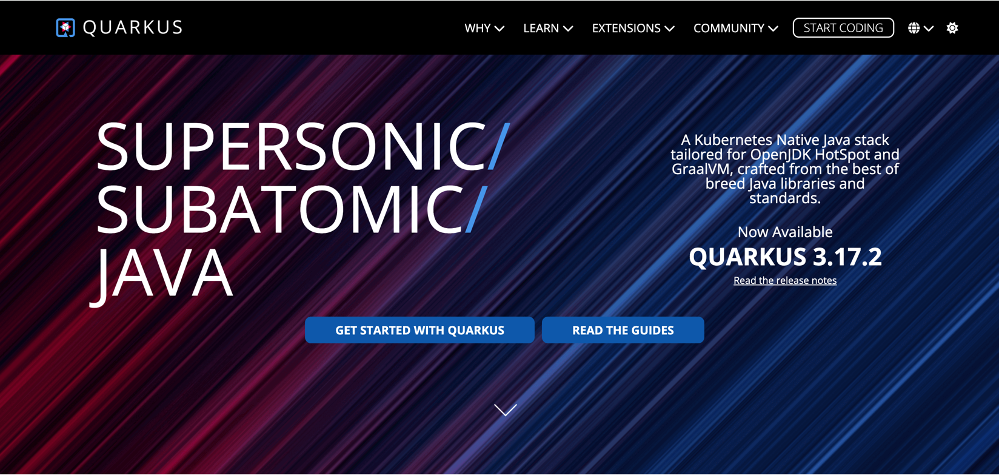
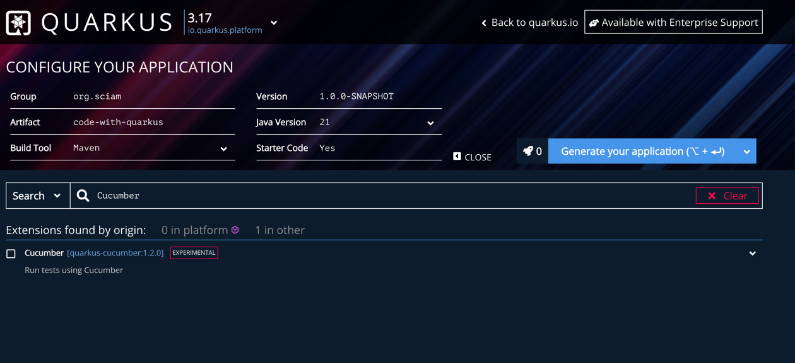

% I need your help on Quarkus Cucumber
% Said BOUDJELDA (Back-end Developer @Sciam.fr)
% December 03, 2024

# Quarkus

## Why Quarkus?

- Java (The programming language of the enterprise world)
- Fast startup, and adaptable for the cloud
- Native compilation

## Why Quarkus?

## Why Cucumber?

- BDD (Behavior Driven Development)
- A framework for writing tests in natural language (Gherkin)
- Make tests readable and understandable by non-technical people

## Why Not Quarkus Cucumber?

## What to do?

- Contribute to the Quarkus Cucumber extension

## What do we need you for?

- Write documentation
- Enhance the extension
- Implement new features

## More ?

## What's next?

- The big refactoring of the extension must come one day

## Thank you!
